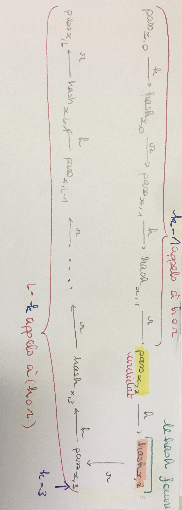
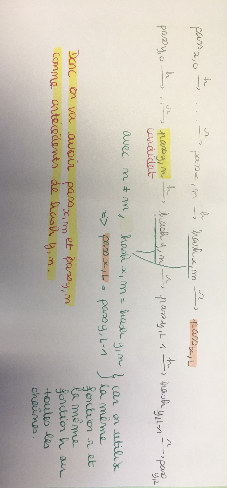

# AP-project

1. "Les mots de passe sont composés de M lettres minuscules" donc on a 26^M possibilités pour l'antécédent d'un hash donné.
on est en O(26^M). On est en complexité exponentielle.

2. Une table de hachage correspond à cette situation : associations de clés/valeurs. On aurait donc 26^M valeurs à stocker dans la table de hachage.  
Table de hachage => recherche en O(1+(26^M)/A) avec A le nombre de cases de la table.  
Pour avoir un remplissage optimal on veut un facteur de charge environ égal à 0.7. Pour avoir α = 0.7, il faut que la taille de notre table soit égale à A = ceil(N/0.7) avec N = 26^M.

3. 
1 possibilité par char, 1 octet par char  
M = 1 : 26 possibilités = 26 octets  
M = 2 : 26*26 ≈ 10²  
M = 3 : 26³ ≈ 10⁵  
M = 4 : 26⁴ ≈ 10⁶  
M = 5 : 26⁵ ≈ 10⁷  
M = 6 : 26⁶ ≈ 10⁸   
M = 7 : 26⁷ ≈ 10⁹ ≈ de l'ordre du giga de RAM  
Il serait donc judicieux de s'arrêter à M = 7 au plus. (On préfèrera même prendre M = 6 pour éviter de dépasser plusieurs Go de RAM)
```
Justification mathématique : 
On part du principe que nous avons au maximum 32 Go de RAM pour stocker ce tableau.
32Go = 32*10⁹ octets
Or 10⁹ = 10³*10³*10³ ≈ 2¹⁰*2¹⁰*2¹⁰≈ 32²*32²*32² ≈ 32⁶
Donc 32*10⁹ ≈ 32⁷ 
Et 26⁷ < 32⁷
Donc il est raisonnable de s'arrêter à M = 7
``` 
4. 
Résumé de l'énoncé :  
  
La fonction de réduction ne varie pas (encore).

D'après la définition "le candidat est un pass dont le hash est égal au hash attaqué" et non "le candidat est le mot de passe recherché" alors un candidat est UN antécédent du hash attaqué.

Dans le cas où l'on considère que "le candidat est le mot de passe recherché" alors on peut avoir deux mots de passes donnent le même hash, et donc le pass renvoyé n'est pas forcément le mot de passe recherché. Mais le candidat est bien un antécédent du hash donné.

Dans tous les cas c'est UN antécédent du hash recherché.



5. 
On peut utiliser une table hachage (complexité en O(1+n/M) pour la recherche d'un élément): association de clés/valeurs (passx,L/passx,0). On génère passx,0, on calcule passx,L à partir de passx,0 et on stocke le couple (passx,L, passx,0) dans la table.

6. 
Nous avons traité ce cas dans la question 2 (voir schéma).  
Si on a 2 pass (passx,i et passy,j) identiques, on a deux cas possibles :  

    - i = j : Dans ce cas, passx,L = passy,L (par déterminisme des fonctions de hachage et de réduction).
    Dans ce cas, il est possible d'avoir deux antécédents différents avec un pass "final" indentique.
    Ca veut dire qu'on a deux pass0 qui donnent le même passL : on n'autorisera pas cette situation dans une table lors de l'implémentation.  

    - i != j : Dans ce cas, passx,L != passy,L, MAIS il existe passx,k avec k dans [i, L[ tel que passx,k = passy,L OU il existe passy,m avec m dans [j, L[ tel que passy,m = passx,L (En gros, l'un des mots de passes est plus proche de la fin de la chaine que l'autre, donc on perd une fin de chaine)
        Dans ce cas, lorsqu'on compare passy,m, passx,k respectivement à passx,L et passy,L, on peut croire qu'on est arrivé "en fin" d'une autre chaine que celle actuelle, menant donc à un mauvais antécédent.


7. 
C'est moins problématique lorsqu'on a une fonction de réduction qui varie car le passx,(i+1) du hashx,i de passx,i est différent du passy,(j+1) du hashy,j de passy,j si i et j sont différents. 

8. 
Dans ce cas, par déterminisme des fonctions de réductions (étant au même rang, la fonction de réduction est la même pour les deux chaines) et de hachage, le dernier élément de chaque chaîne est le même.
- Dans le cas où il est possible d'avoir plusieurs candidats, c'est relativement problématique, car on trouve forcément deux antécédents pour un même dernier élément, qui peuvent être égaux ou non : on a donc deux antécédents différents.
- Dans le cas où l'on souhaite n'avoir qu'un seul candidat, c'est problématique.

9. 
On a vu que le seul cas de collision possible survient quand on a deux passx,i passy,i identiques sur la même colonne (au même indice).  
On cherche à savoir à partir de combien d'itérations en moyenne on a cette collision. C'est-à-dire qu'on a une collision à partir d'un certain rang k et donc aucune collision avant (car une collision implique que tous les passx,i avec i > k seront identitiques aux passy, i)  
[SCHEMA ICI]  
On utilise donc une loi géométrique de paramètre p = 1/26^M (proba d'équivalence entre deux mots de passes aléatoires).  
On a donc :  
Prob(X=1) = p(1-p)^(1-1) = p (Donc u0 = p)  
.......  
Prob(X=L) = p(1-p)^(L-1)  

Lorsque l'on fait la somme des termes de cette suite on a :  
Proba(collision) = **somme des termes pour i allant de 0 à L-1 de (p*(1-p)^i)** avec p = 1/26^M  
= p*[(1-(1-p)^L) / 1-(1-p)]  
= 1-(1-p)^L   
= 1-((1-(1/26^M))^L)

ATTENTION: RESULTAT QUI PART DU PRINCIPE QUE ri et h SONT PARFAITES ET NE PRODUISENT PAS DEUX RESULTATS IDENTIQUES POUR DEUX ENTREES DIFFERENTES!
IL FAUDRAIT MULTIPLIER NOTRE RESULTAT PAR UN FACTEUR DE FIABILITE DE h ET DE r.

10. 
Si on utilise la question précédente, on a une proba de collision proche de 0 quelques soient les valeurs de M et de L (et donc en théorie, on n'a pas de collision donc on peut insérer 26^M valeurs dans une table d'au moins 26^M cases sans difficulté).  
En revanche, en ajoutant un coefficient d'erreur pour les fonctions de hash et de réduction, on est vite limités si on a pas pas plus de cases dns la table que de mots à stocker.  

De manière empirque, on observe que l'on peut stocker 10000 mots dans 100000 cases sans avoir beaucoup de collisions, soit un facteur 10 de N : si on a 10*N cases pour stocker N valeurs, on arrive à insérer les N valeurs sans avoir à gérer beaucoup de collisions sur les dernières insertions.  

Dans l'idéal, on cherche à avoir un coeff nbDeValeursAStocker/TailleDeLaTable = α = 0.7 => TailleDeLaTable = nbDeValeursAStocker/0.7 = nbDeValeursAStocker x 1.4286.  
Donc pour 10 000 valeurs à stocker, une table de 14 286  cases serait satisfaisante. Dans ce cas on serait en O(n).  

11.  

Pour le programme rainbow_create, nos valeurs passx0 ne sont pas générées de manière aléatoire, mais utilisent un compteur incrémental, de manière à avoir une unicité des passx0 entre les fichiers. Nous nous sommes dit que cela "occupait" autant d'espace dans l'ensemble des pass existants que des valeurs aléatoires, d'autant plus que la fonction de hashage est censée renvoyer des valeurs très différentes pour des valeurs d'entrées similaires.

En plus de la commande unique "make" permettant de compiler tous les programmes en une fois, nous avons fourni les commandes:
- "make test_create": exécute le programme rainbow_create, qui génère les différents fichiers des rainbow tables.
- "make test_hash_many": exécute le programme hash_many, qui calcule les hashs des mots de passe contenu dans "hash_many_files/hash_many_input.txt" et les écrits dans le fichier "hash_many_files/hash_many_output.txt".
- "make test_attack": exécute le programme rainbow_attack, qui attaque le fichier crackme2023_6.txt. Attention, vérifier avant que la valeur de la constante M du fichier hash.h vaut bien 6.  Les fichiers pris par défaut correspondent à ceux générés par défaut par test_create.
- "make test_attack_hash_many": exécute le programme rainbow_attack, qui attaque le fichier généré par le programme hash_many. 
- "make clean": qui supprime les exécutables produits par le "make". A exécuter après tout changement des valeurs dans les fichiers ".h"

Ces commandes sont non exaustives, et nous ont uniquement aidé lors du développement. Il est toujours possible d'utiliser les commandes avec leur spécification telle que donnée dans le sujet de TP.


12.     

Avec les valeurs M=6, R=10, N=100000, et L=1000, nous avons réussi à craquer 86% des hashs (les mots de passe retrouvés sont des mots cohérents, ce qui nous indique que nous avons bien réussi à craquer les hashs). Ce score a été obtenu après une génération des tables durant 6 minutes environ, puis 8 minutes de craquage.

Après avoir un peu expérimenté avec les résultats, nous avons remarqué de meilleurs résultats en augmentant le nombre de lignes N et de fichiers R. Nous avons essayé 
de diminuer la taille L des chaînes, mais cela n'a donné que moins de résultats.

Notre meilleur score est de 91,23%, avec M=6, R=13, N=110000 et L=1000. Nous n'avons pas testé avec de plus grandes valeurs de R et N, car nous n'avons pas eu le temps. Le plus long est actuellement de générer les rainbow tables (environ 22 minutes), car nous n'avons pas parallélisé le processus de création. Cependant, le processus de recherche a été parallélisé à l'aide de threads, et tourne en environ 10 minutes sur les PC de l'ensimag (salle e102, avec 4 threads).

Nous avons essayé le programme sur le fichier crackme2023_7.txt, avec les valeurs M=7, R=10, N=100000, et L=1000, ce qui a pris un temps presque double, pour 11,68% de mots de passe trouvés.

Les scores obtenus nous semblent difficle à améliorer de manière significative, sauf en augmentant énormément le nombre de fichiers et de lignes, ce qui engendre des temps de calcul très longs.

Un axe d'amélioration est notre fonction de hash pour "ranger" les valeurs de pass0 dans la table de hashage générale (lors de l'attaque), qui hash tous les caractères de la pass0 (ce qui est à éviter, comme étudié en TP, mais qui fonctionnait très correctement pour des mots de passe à 6 charactères).

Détails techniques :
- Le nombre de thread n'est pas géré automatiquement selon les spécifications hardware du PC, il faut donc le régler par soi-même. Par défaut, 4 threads sur les PC de l'ensimag semble bien fonctionner, car les CPUs ont une bonne fréquence (3,5GHz). Nous avons testé sur un PC personnel disposant de 8 coeurs, avec 7 threads, cependant les CPUs n'ont qu'une fréquence de 2,7GHz, ce qui a ralenti très fortement notre programme (presque le double de temps pour chaque opération create et attack.)
- Nous avons utilisé le programme "time" devant nos commandes pour calculer le temps d'exécution de nos programmes.
- Pour compter le nombre de lignes non vides dans le fichier found_6.txt (ou found_7.txt), nous avons compté les lignes non vides à l'aide de la commande bash
\$ cat foo.txt | sed '/^\s*$/d' | wc -l
Où "foo.txt" correspond au fichier de sortie du programme rainbow_attack. Cette commande a été trouvée ici : "https://stackoverflow.com/questions/114814/count-non-blank-lines-of-code-in-bash". Nous aurions aussi pu faire cela avec un nouveau programme c, mais la commande nous suffisait.


13.    
Techniques implémentées de nos jours pour se prémunir des attaques par Rainbow Table : 

- Salage :  Ajout dans chaque pass (durant le processus de hachage) d'une chaîne unique générée aléatoirement.  
Cela oblige qui veut craquer les hash de mots de passe à le faire un mot de passe à la fois en prenant en compte le fait qu'il y a eu un ajout avant hachage : le temps de crackage augmente proportionellement au nombre de mots de passe.  

- Poivrage :  Peut être utilisé en complément du salage. Technique qui consiste à encrypter avec une clé symétrique les hash de mot de passe avant de les stocker dans la table. Le “poivre” (la clé) est partagée entre les hash.  
La clé n’est pas stockée dans la table.  

- Work factor :  Technique qui consiste à rendre le calcul du hash très long et très coûteux en opérations pour rendre l’attaque de mot de passe plus longue.  

- Meilleurs algorithmes de hachage:
Plus coûteux en temps que MD5, par exemple Aragon2id qui prend en paramètres la taille minimum de la mémoire(m), le nombre minimum d’opérations(t), et le degré de parallélisme(p). Plusieurs configurations sont possibles mais les suivantes sont recommandées:   
    m=12288 (12 MiB), t=3, p=1  
    m=9216 (9 MiB), t=4, p=1  
    m=7168 (7 MiB), t=5, p=1  

D’autre fonctions à plusieurs paramètres sont utilisées comme scrypt et bcrypt utilisant directement la taille de la mémoire. 
